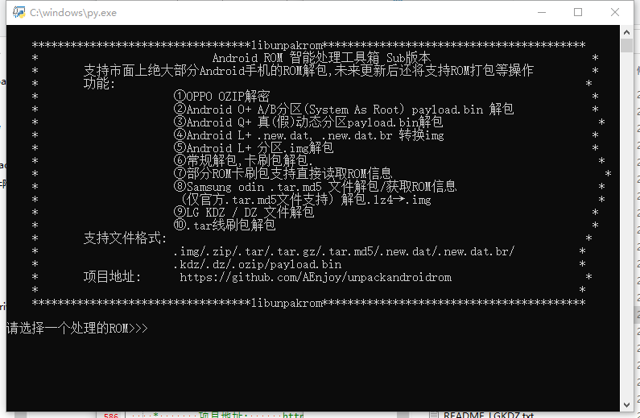

# Rom处理工具(Python)

此项目使用Python语言,一键解包安卓ROM的system.img

由于各大手机厂商基本上已经封闭了ROM的下载和获取,后继对于ROM解包支持可能会难以维护

目前主要支持安卓10及以下的ROM解包(以及安卓10及以上标准的动态分区/AB分区解包支持)


支持格式:

> .new.dat.  .new.dat.br  .img  .tar.md5  .ozip  .kdz  .dz  .bin  .zip  .tar

其中,ozip,new.dat(.br),img,payload.bin,以及部分zip可以一键解包出system.

同时,还可以嗅探某些ROM的底层(魅族 魅蓝note5/6 嗅探底层成功)

支持几乎除了安卓10动态分区外的所有卡刷包,以及三星,LG线刷包,ozip解密等

特点:将众多开源项目涵盖在了一个项目中,方便ROM的解包操作及寻找开源项目

(若main处理不了,你还可以用其它的,不过会略微麻烦就是了)


测试结果:→[前往观赏测试图](pic)

可以正常识别目前我见到的卡刷包

oppo ozip解密解包功能正常(仅部分机型)(含.new.dat.br)

三星官方tar.md5解包system正常

MIUI线刷包卡刷包解包正常

魅族 new.dat解包正常

360 普通打包方式解包正常

Google AB payload.bin解包正常

LG KDZ解包正常

(暂未添加DZ解包)

食用步骤:

Clone该项目:

```
git clone --depth=1 https://hub.fastgit.org/AEnjoy/unpackandroidrom.git
```

安装依赖:

```shell
python3 install_requirements.py
# or
pip install -r requirements.txt
```

运行:

```shell
python3 main.py
```

(提交bug -_-||,无情嘲讽)

可选操作:

定期执行-清理缓存

```shell
python clean_cache.py
```

定期执行-项目同步

```shell
git pull
```



本项目引用的项目(文件)列表及来源:

oppoozip:https://github.com/tahirtaous/ozip2zip
~~extract_android_ota_payload:https://github.com/cyxx/extract_android_ota_payload~~
sdat2img:https://github.com/xpirt/sdat2img
rimg2sdat:https://github.com/jazchen/rimg2sdat
LGKDZ:https://github.com/randomstuffpaul/kdztools
PayloadDumperOnDocker:https://github.com/matze19999/PayloadDumperOnDocker
simg2img:https://code.google.com/p/simg2img

运行环境需求:

Python2.7/Python3.6+

运行依赖包含在requirements.txt文件中,你可以运行install_requirements.py 一键安装依赖

Changes:

```
2.2.4→2.2.5:2024-7-7 17:35:59
1.Upgrade Docs.
2.Fix TypeError thanks to @WangBoee

2.2.3→2.2.4:2021-8-22 23:09:49
1.旧版本号忘记更新了,现在更新回来
2.修复三星线刷包解包失败问题(Thanks to CoolApkUser:名字嘛随机取一个)
3.修复三星线刷包识别可能失败的问题
4.清理代码中的垃圾部分
5.make.py Update:减小打包后的文件体积
6.make.py Update:根据系统,系统架构自动重命名压缩包文件
7.修复MIUI线刷包解包后可能会出现错误的问题
8.解决识别部分ROM后产生的垃圾文件未自动清理的问题
9.默认自动转换动态分区super.img文件

2.2.2→2.2.3:2021-8-22 19:09:49
1.修复MIUI线刷包解包后可能会出现错误的问题
2.解决识别部分ROM后产生的垃圾文件未自动清理的问题
3.默认自动转换动态分区super.img文件

2.2.2→2.2.3:2021-8-20 01:25:48
1.旧版本号忘记更新了,现在更新回来
2.修复三星线刷包解包失败问题(Thanks to CoolApkUser:名字嘛随机取一个)
3.修复三星线刷包识别可能失败的问题
4.清理代码中的垃圾部分
5.make.py Update:减小打包后的文件体积
6.make.py Update:根据系统,系统架构自动重命名压缩包文件

2.2.1→2.2.2:2021-8-19
1.Bug Fixed.

2.1→2.2.1:on 1 Jul
1.增加了Linux arm64的编译
2.增加了有关pycrypto的readme
3.现在没有pycrypto依赖也可以运行项目
4.make.py支持手动编译,方便跨平台

2→2.1:2020-8-16 13:19:14
1.修复了一个小bug

1→2:2020-8-15 21:58:28
1.更新lz4,brotli解包代码
2.更新依赖(可能需要重新运行install_requirements.py)
3.LG DZ解包支持(之前只支持查看)
4.MIUI线刷包解包
```

根据上游开源,本项目开源许可协议为GNU/GPL3